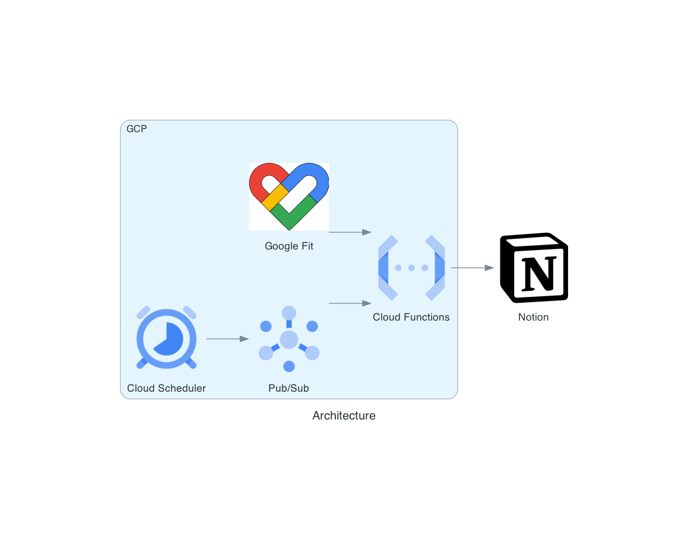

# Google Fit Notion Integration

GoogleFitNotionIntegrationは、Google Fitから取得した運動履歴を自動的にNotionデータベースに同期させるシステムです。  
Cloud Scheduler, PubSub, そしてCloud Functionsを活用して、定期的にデータを収集・加工し、あなたの健康管理と運動の進捗をNotionで簡単に追跡できるようにします。  
この統合により、運動習慣の可視化と分析が手間なく行えるようになり、健康管理の質を向上させることができます。  
Google Fitの豊富な運動データを活用して、より豊かな健康管理ライフスタイルを実現しましょう。  

## アーキテクチャ

## 使い方

